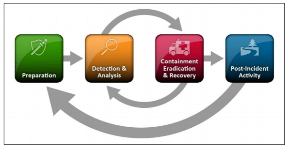
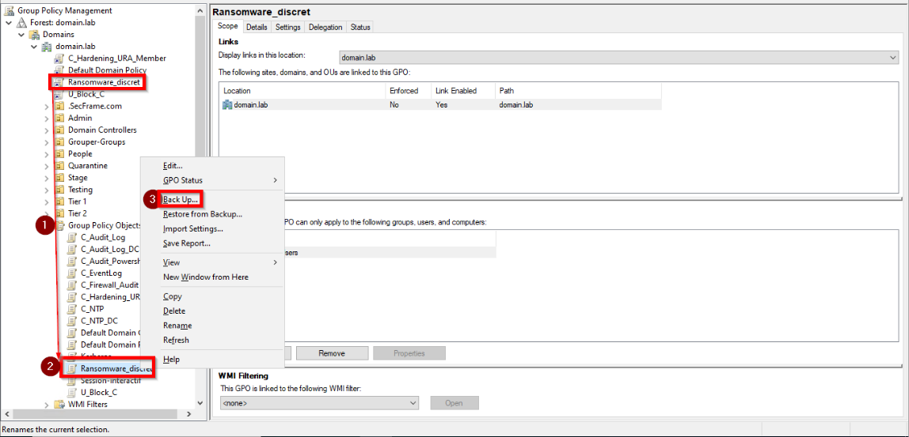
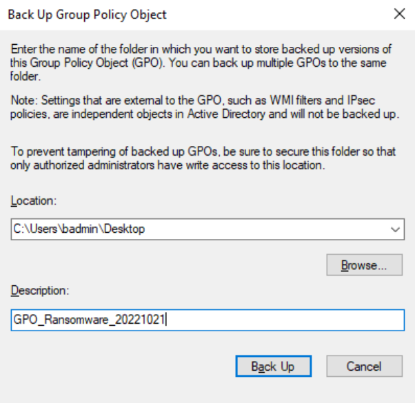
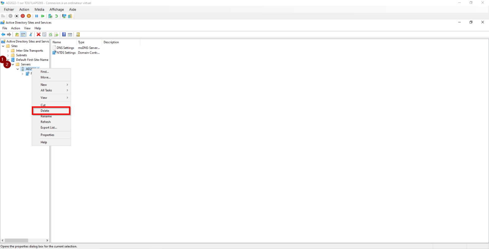
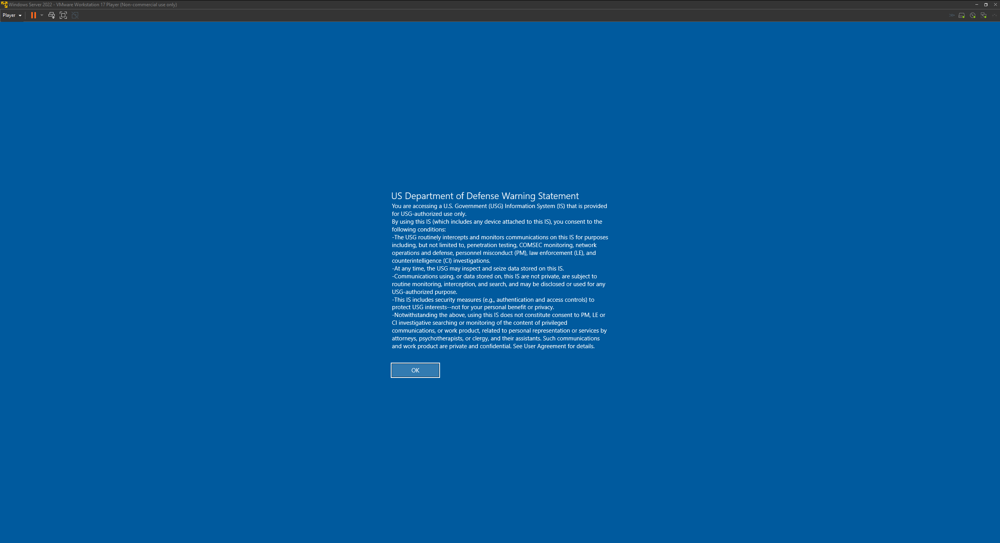
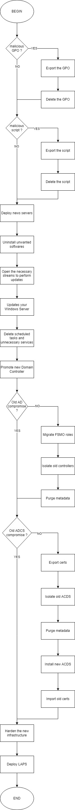

- [PURPOSE](#purpose)
- [DEFINITIONS](#definitions)
- [CHRONOLOGY](#chronology)
- [USUAL MODUS OPERANDI OF RANSOMWARE](#usual-modus-operandi-of-ransomware)
- [LIST OF ACTIONS TO TAKE](#list-of-actions-to-take)
  - [NETWORK](#network)
  - [STOP THE DEPLOYMENT OF ENCRYPTION](#stop-the-deployment-of-encryption)
    - [EXPORT GPO](#export-gpo)
    - [DELETE GPO](#delete-gpo)
    - [CLEAN THE SYSVOL FOLDER](#clean-the-sysvol-folder)
      - [SAVE THE SCRIPT FOLDER](#save-the-script-folder)
      - [DELETE THE FILE](#delete-the-file)
  - [BUILD THE NEW DOMAIN](#build-the-new-domain)
    - [DEPLOY NEW SERVER](#deploy-new-server)
    - [Remove undesirable software](#remove-undesirable-software)
    - [UPDATE THE OS](#update-the-os)
    - [DELETE USELESS SCHEDULED TASK AND SERVICES](#delete-useless-scheduled-task-and-services)
    - [PROMOTE NEW DOMAIN CONTROLLER](#promote-new-domain-controller)
      - [MIGRATE FSMO ROLE](#migrate-fsmo-role)
      - [PURGE METADATA](#purge-metadata)
  - [CERTIFICATE](#certificate)
    - [EXPORT CERTIFICATE ON THE OLD INFRASTRUCTURE](#export-certificate-on-the-old-infrastructure)
    - [ISOLATE OLD ADCS](#isolate-old-adcs)
    - [DELETE THE OLD ADCS ON YOUR NEW INFRASTRUCTURE](#delete-the-old-adcs-on-your-new-infrastructure)
    - [INSTALL NEW ADCS](#install-new-adcs)
    - [UPDATE THE OS](#update-the-os-1)
    - [ADD AND CONFIGURE NEW ROLE](#add-and-configure-new-role)
  - [HARDENING YOUR NEW INFRASTRUCTURE](#hardening-your-new-infrastructure)
    - [QUICK WIN ON DOMAIN - MICROSOFT BASELINE](#quick-win-on-domain---microsoft-baseline)
    - [QUICK WIN LOCAL HOSTS FOR INCIDENT RESPONDER - U.S DEPARTMENT OF DEFENSE](#quick-win-local-hosts-for-incident-responder---us-department-of-defense)
  - [TIER MODEL / ENTERPRISE ACCESS MODEL](#tier-model--enterprise-access-model)
    - [DEPLOY LAPS](#deploy-laps)
- [FLOWCHART](#flowchart)

# PURPOSE
This document aims to describe the first steps to take in case of a ransomware compromise within your infrastructure and you have to rebuild a new one.

# DEFINITIONS
* Ransomware : Ransomware is a type of malicious attack where attackers encrypt an organization's data and demand payment to restore access. Attackers may also steal an organization's information and demand an additional payment in return for not disclosing the information to authorities, competitors, or the public. ([source](https://csrc.nist.gov/publications/detail/nistir/8374/final))
* PsExec : PsExec is a light-weight telnet-replacement that lets you execute processes on other systems, complete with full interactivity for console applications, without having to manually install client software. ([source](https://learn.microsoft.com/en-us/sysinternals/downloads/psexec))
* GPO : A Group Policy Object (GPO) is a virtual collection of policy settings. ([source](https://learn.microsoft.com/en-us/previous-versions/windows/desktop/policy/group-policy-objects))
* ADCS : AD CS provides customizable services for issuing and managing digital certificates used in software security systems that employ public key technologies. ([source](https://learn.microsoft.com/en-us/previous-versions/windows/it-pro/windows-server-2012-r2-and-2012/hh801901(v=ws.11)))

# CHRONOLOGY
This document is at the "containment, eradication and recovery" part of the incident lifecycle. 

This means that detection and analysis has already begun and has identified (at least) a portion of the impacted perimeter. 

# USUAL MODUS OPERANDI OF RANSOMWARE 
* Many ransomwares are deployed by using PsExec locally or via a GPO. 
  * When the deployment uses GPOs it often binds to the domain root to impact all compatible devices in the domain. 
  * The name of this GPO is often randomly generated.
  * When the deployment is done via PsExec it is often preceded by the creation of a scheduled task that will execute the encryption command.

# LIST OF ACTIONS TO TAKE
## NETWORK
In this documentation, we will speak very little about the network part.
For a simple reason, you will have to recreate everything using whitelisting (everything that is not explicitly allowed must be prohibited).
Don't have any baselines? Now is the time to create one.

## STOP THE DEPLOYMENT OF ENCRYPTION
### EXPORT GPO
The first action to take is to save the GPO for future investigation. 
* Go to Group Policy Object
* Select the GPO
* Right Clic > Back up

### DELETE GPO
* Go to Group Policy Object
* Select the GPO
* Right clic > Delete

### CLEAN THE SYSVOL FOLDER
In some cases, the GPO executes a script in \\domain\sysvol\domain\scripts\ .

#### SAVE THE SCRIPT FOLDER
* Go to the folder \\domain\sysvol\domain\scripts\ and save the scrip in a encrypted archive.
  * To save time, the default password will be: infected.
  * Why save in a password protected archive? To keep the file without a scanner being able to delete it.

#### DELETE THE FILE
Once the file is saved in a protected archive, delete the original file. 

## BUILD THE NEW DOMAIN
For a disaster recovery, it will most likely be necessary to remount a domain for the customer. 

### DEPLOY NEW SERVER
* Deploy a new server in a new isolated network.
  * This installation must not be done via a template, VM copy or other. It must be done via an ISO downloaded for the occasion. 
* Achieve maximum hardening of the OS.
* Open the ports and URLs necessary for the proper functioning of the environment (at least Windows Update for the moment).
  * Use the URL.txt

### Remove undesirable software
Even if the installation is new, it is important to check each component that can be uninstalled to keep only what is necessary for proper operation. 

PowerShell : Use [Powershell gallery](https://www.powershellgallery.com/packages/ITPS.OMCS.Tools/1.6/Content/Scripts%5CGet-InstalledSoftware.ps1)

### UPDATE THE OS
Once the computer is installed and hardened, it is advisable to apply all the updates available from the Internet and not from an internal share, which can be compromised. 

PowerShell : Use [Powershell gallery](https://www.powershellgallery.com/packages/PSWindowsUpdate/2.2.0.3)

### DELETE USELESS SCHEDULED TASK AND SERVICES
Even if the installation is new, it is important to check that no unwanted or mandatory scheduled tasks are created. 

* ScheduledTasks : https://learn.microsoft.com/en-us/powershell/module/scheduledtasks/get-scheduledtask?view=windowsserver2022-ps 
* Services : https://learn.microsoft.com/en-us/powershell/module/microsoft.powershell.management/get-service?view=powershell-7.2

### PROMOTE NEW DOMAIN CONTROLLER
* Case 1: the domain is totally compromised.

In the case of a compromised domain, no connection must be made between the compromised domain and the new domain controller. 
_You will have to start from scratch and recreate the entire infrastructure._

* Case 2: the domain is not totally compromised.

In case the domain has been only partially compromised (the attacker has set up his ransomware but the domain controller servers are still reachable and the link with the outside world is closed, the ransomware is no longer deploying) then it is possible to transfer the FSMO roles to the new domain controller(s)

**The bext step is only if your in the second case**

#### MIGRATE FSMO ROLE
* Use this command to migrate FSMO rôle

_Move-ADDirectoryServerOperationMasterRole -Identity "NewDC" -OperationMasterRole 0,1,2,3,4 -Verbose_

|ROLE|NUMBER|
|:---------------:|:---------------:|
|PDCEmulator|0|
|RIDMaster|1|
|InfrastructureMaster|2|
|SchemaMaster|3|
|DomainNamingMaster|4|

* Check the migration

_netdom query FSMO_

#### PURGE METADATA
* Remove old domains from the Active Directory architecture

_Get-ADComputer -Identity "OLD_DC" | Remove-ADObject -Recursive_

* Open "Active Directory Sites and Services"
* Delete old domain controller

## CERTIFICATE
**This part should only be done if you are convinced that the ADCS server has not been compromised.**

### EXPORT CERTIFICATE ON THE OLD INFRASTRUCTURE
The purpose of this part is to recover all the certificates present in your environment.
The objective is twofold:
* To be able to re-inject them in the new infrastructure in emergency for some critical services
* To be able to analyze all present certificates and identify potential unwanted certificates

To do this, use the following command and save it in an archive with a password.
_Backup-CertificationAuthority -Path C:\CertSave -BackupKey -Password P@ssw0rd -Extended_

Documentation : https://learn.microsoft.com/en-us/windows-server/identity/ad-ds/manage/component-updates/ca-backup-and-restore-windows-powershell-cmdlets

### ISOLATE OLD ADCS
Once the certificates are recovered, disconnect the old ADCS servers. 

### DELETE THE OLD ADCS ON YOUR NEW INFRASTRUCTURE
_Get-ADComputer -Identity "OLD_ACDS" | Remove-ADObject -Recursive_

### INSTALL NEW ADCS
* Deploy a new server in a new isolated infrastructure. 
  * This installation must not be done via a template, VM copy or other. It must be done via an ISO downloaded for the occasion. 
* Achieve maximum hardening of OS.
* Open the ports and URLs necessary for the proper functioning of the environment (at least WIndows Update for the moment).
  * Use the URL.txt

### UPDATE THE OS
Once the computer is installed and hardened, it is advisable to apply all the updates available from the Internet and not from an internal share, which can be compromised. 

PowerShell : Use [Powershell gallery](https://www.powershellgallery.com/packages/PSWindowsUpdate/2.2.0.3)

### ADD AND CONFIGURE NEW ROLE
* Add the ADCS role
* When ask for private key :
  * Select "Use existing private key"
  * Select a certificate and use its associeted private key
* Import the key save previously
* Check
* Execute the two reg files create during the backup

## HARDENING YOUR NEW INFRASTRUCTURE
To avoid a configuration breach in the new infrastructure, an audit and hardening of the configuration of the new Active Directory infrastructure should be performed. 

Two free softwares that will help.
* Pingcastle
  * URL : https://www.pingcastle.com/download/
* Purple Knight
  * URL : https://fr.purple-knight.com/request-form/

_Both of these programs are free for auditing your own infrastructure. However, do not hesitate to inquire about the pricing and the possibilities offered by this one._ 

### QUICK WIN ON DOMAIN - MICROSOFT BASELINE
A quick way to harden your infrastructure is to deploy Microsoft baselines from the Microsoft site to your AD. It's not the best but it's a first step.

* Go the [this URL](https://www.microsoft.com/en-us/download/details.aspx?id=55319)
* Select "Download"
* Select the OS you have in the domain
* Go to each folder
* Execute the script "Baseline-ADImport"

### QUICK WIN LOCAL HOSTS FOR INCIDENT RESPONDER - U.S DEPARTMENT OF DEFENSE
The United States Department of Defense is an executive branch department of the federal government charged with coordinating and supervising all agencies and functions of the government directly related to national security and the United States Armed Forces. The DoD is the largest employer in the world, with over 1.34 million active-duty service members (soldiers, marines, sailors, airmen, and guardians) as of June 2022. 

* Go on the host you want to hardening
* Go to [this URL](https://public.cyber.mil/stigs/gpo/)
* Use the link at the bottom to download
* Extract all
* Go to [this URL](https://www.microsoft.com/en-us/download/details.aspx?id=55319)
* Download LGPO.zip
* Extract all
* Go to LGPO's folder
* Open PowerShell in administrator
* _lgpo.exe /g PATH_

Exemple : 

_.\LGPO.exe /g '..\..\U_October_2022_STIG_GPO\DoD WinSvr 2022 MS and DC v1r1\GPOs'_

If you want to know if it works, just reboot the host.

## TIER MODEL / ENTERPRISE ACCESS MODEL
Although the three-tier model no longer exists in its own right, its pattern has evolved but remains a foundation to implement when creating your new infrastructure.

Documentation : https://learn.microsoft.com/en-US/security/compass/privileged-access-access-model

### DEPLOY LAPS
The infrastructure is now restored. 

It is now necessary to deploy LAPS via GPO on all the client workstations and servers, starting with Tier 0, so that the local administrators' passwords are changed and hardened. 

The objective is that the local administrator password is difficult to find and that in case of compromise, this password is not found on the whole park. 

[Installation how to](https://m365internals.com/2021/05/14/how-to-roll-out-microsoft-laps-via-gpo-and-use-it-for-administration/)

# FLOWCHART
This diagram summarizes the actions we have see before in this article.

