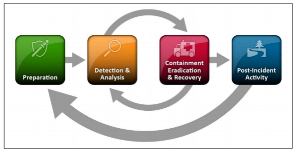
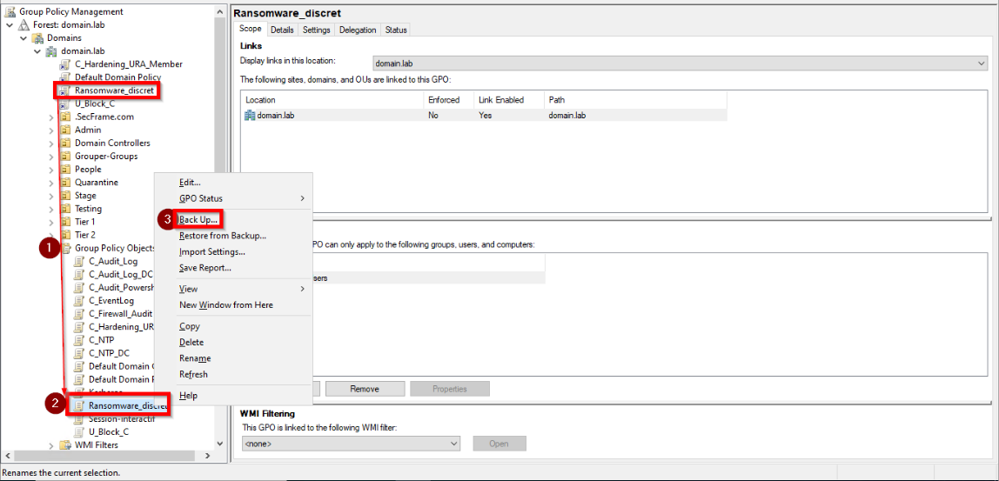
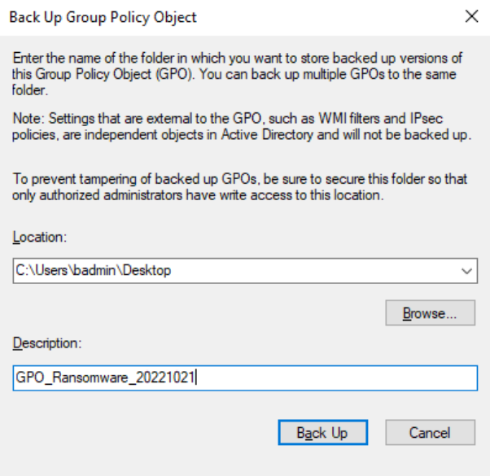
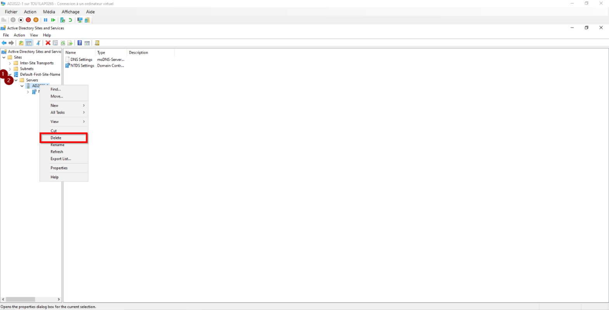
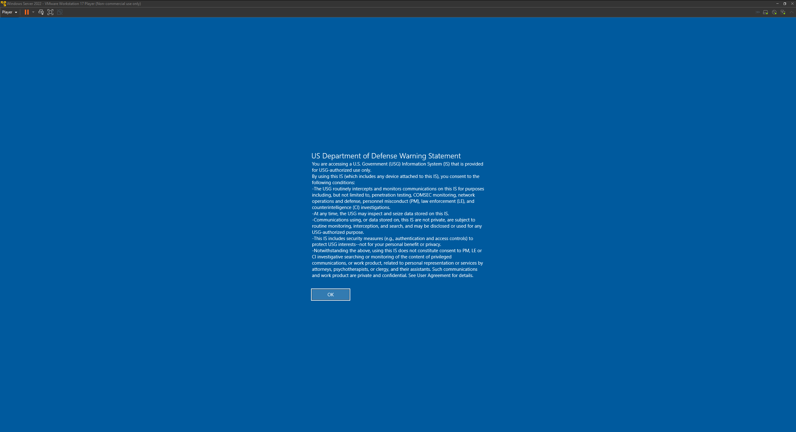
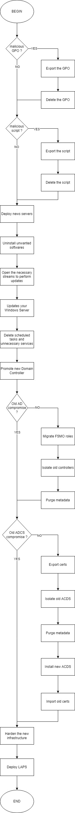

- [BUT](#but)
- [DEFINITIONS](#definitions)
- [CHRONOLOGIE](#chronologie)
- [LE MODE OPERATOIRE HABITUEL DES RANSOMWARES](#le-mode-operatoire-habituel-des-ransomwares)
- [LISTE DES ACTIONS À ENTREPRENDRE](#liste-des-actions-à-entreprendre)
  - [RESEAUX](#reseaux)
  - [ARRÊTER LE DÉPLOIEMENT DU CRYPTAGE](#arrêter-le-déploiement-du-cryptage)
    - [EXPORTER LA GPO](#exporter-la-gpo)
    - [SUPPRIMER LA GPO](#supprimer-la-gpo)
    - [NETTOYER LE DOSSIER SYSVOL](#nettoyer-le-dossier-sysvol)
      - [SAUVEGARDER LE DOSSIER DU SCRIPT](#sauvegarder-le-dossier-du-script)
      - [SUPPRIMER LE FICHIER](#supprimer-le-fichier)
  - [CONSTRUIRE LE NOUVEAU DOMAINE](#construire-le-nouveau-domaine)
    - [DEPLOYER LE NOUVEAU SERVEUR](#deployer-le-nouveau-serveur)
    - [SUPPRIMER LES LOGICIELS INDESIRABLES](#supprimer-les-logiciels-indesirables)
    - [METTRE A JOUR LE SYSTEME D'EXPLOITATION](#mettre-a-jour-le-systeme-dexploitation)
    - [SUPPRIMER LES TÂCHES ET SERVICES INUTILES](#supprimer-les-tâches-et-services-inutiles)
    - [PROMOUVOIR UN NOUVEAU CONTRÔLEUR DE DOMAINE](#promouvoir-un-nouveau-contrôleur-de-domaine)
      - [MIGRER LES RÔLES FSMO](#migrer-les-rôles-fsmo)
      - [PURGER LES DONNEES](#purger-les-donnees)
  - [CERTIFICAT](#certificat)
    - [EXPORTER LES CERTIFICATS DE L'ANCIENNE INFRASTRUCTURE](#exporter-les-certificats-de-lancienne-infrastructure)
    - [ISOLER L'ANCIEN SERVEUR ADCS](#isoler-lancien-serveur-adcs)
    - [SUPPRIMER LES ANCIENS ADCS SUR VOTRE NOUVELLE INFRASTRUCTURE](#supprimer-les-anciens-adcs-sur-votre-nouvelle-infrastructure)
    - [INSTALLER VOS NOUVEAUX ADCS](#installer-vos-nouveaux-adcs)
    - [METTRE A JOUR LE SYSTEME D'EXPLOITATION](#mettre-a-jour-le-systeme-dexploitation-1)
    - [AJOUTER ET CONFIGURER CE NOUVEAU RÔLE](#ajouter-et-configurer-ce-nouveau-rôle)
  - [DURCISSEMENT DE VOTRE NOUVELLE INFRASTRUCTURE](#durcissement-de-votre-nouvelle-infrastructure)
    - [QUICK WIN - MICROSOFT BASELINE](#quick-win---microsoft-baseline)
    - [QUICK WIN ORDINATEURS LOCAUX DE REPONSES A INCIDENT - U.S DEPARTMENT OF DEFENSE](#quick-win-ordinateurs-locaux-de-reponses-a-incident---us-department-of-defense)
  - [MODELE TROIS TIERS](#modele-trois-tiers)
    - [DEPLOYER LAPS](#deployer-laps)
- [DIAGRAMME](#diagramme)

# BUT
Ce document vise à décrire les premières mesures à prendre en cas de compromission de votre infrastructure par un ransomware et que vous devez en reconstruire une nouvelle.

# DEFINITIONS
* Ransomware : Un rançongiciel ou ransomware en anglais est un code malveillant qui bloque l’accès à votre appareil ou à des fichiers en les chiffrant et qui vous réclame le paiement d’une rançon pour obtenir le déchiffrement de vos données. ([source](https://www.cybermalveillance.gouv.fr/tous-nos-contenus/actualites/ransomware-rancongiciel-definition))
* PsExec : PsExec est un remplacement telnet léger qui vous permet d’exécuter des processus sur d’autres systèmes, avec une interactivité complète pour les applications console, sans avoir à installer manuellement les logiciels clients. Les utilisations les plus puissantes de PsExec incluent le lancement d’invites de commandes interactives sur des systèmes distants et des outils d’activation à distance tels que IpConfig qui, sinon, n’ont pas la possibilité d’afficher des informations sur les systèmes distants. ([source](https://learn.microsoft.com/fr-fr/sysinternals/downloads/psexec))
* GPO : Une GPO est une collection de règle de sécurité. ([source](https://learn.microsoft.com/en-us/previous-versions/windows/desktop/policy/group-policy-objects))
* ADCS : AD CS fournit des services personnalisables pour l'émission et la gestion de certificats numériques. ([source](https://learn.microsoft.com/en-us/previous-versions/windows/it-pro/windows-server-2012-r2-and-2012/hh801901(v=ws.11)))

# CHRONOLOGIE
Ce document se situe dans la partie "confinement, éradication et récupération" du cycle de vie de l'incident. 

Cela signifie que la détection et l'analyse ont déjà commencées et ont permis d'identifier (au moins) une partie du périmètre impacté.

# LE MODE OPERATOIRE HABITUEL DES RANSOMWARES 
* De nombreux ransomwares sont déployés en utilisant PsExec localement ou via un GPO.. 
  * WLorsque le déploiement utilise des GPO, il se lie souvent à la racine du domaine pour avoir un impact sur tous les appareils compatibles du domaine. 
  * Le nom de cette GPO est souvent généré de manière aléatoire.
_C'est pourquoi surveiller les GPO qui dont le nom ne respecte pas votre nomenclature est important._
  * Le déploiement est parfois accompagné de la création d'une tâche planifiée qui exécutera la commande de chiffrement.

# LISTE DES ACTIONS À ENTREPRENDRE
## RESEAUX
Dans cette documentation, nous ne parlerons que très peu de la partie réseau.
Pour une raison simple, vous allez devoir tout recréer en utilisant la fonctionnement par liste blanche (tout ce qui n'est pas explicitement autorisé doit être interdit).
Vous n'avez pas de baseline ? C'est le moment d'en créer une.

## ARRÊTER LE DÉPLOIEMENT DU CRYPTAGE
_Oui le mot cryptage est le bon dans ce cas là._
### EXPORTER LA GPO
La première action à entreprendre est de sauvegarder la GPO pour une étude ultérieure. 
* Se rendre dans la partie "Group Policy Object"
* Sélectionner la GPO
* Faire un clic droit > Sauvegarder

### SUPPRIMER LA GPO
* Se rendre dans la partie "Group Policy Object"
* Sélectionner la GPO
* Faire un clic droit > Supprimer

### NETTOYER LE DOSSIER SYSVOL
Dans certains cas, la GPO exécute un script depuis \\domain\sysvol\domain\scripts\ .

#### SAUVEGARDER LE DOSSIER DU SCRIPT
* Se rendre dans le dossier \\domain\sysvol\domain\scripts\ et sauvegarder le script dans une archive avec mot de passe.
  * Pour gagner du temps, le mot de passe par défaut sera: infected.
  * Pourquoi enregistrer dans une archive avec mot de passe ? Pour Garder le fichier sans qu'un scanner puisse le supprimer.

#### SUPPRIMER LE FICHIER
Une fois que le fichier est enregistré dans une archive protégée, supprimez le fichier original. 

## CONSTRUIRE LE NOUVEAU DOMAINE
Pour une reprise après sinistre, il sera très probablement nécessaire de remonter un domaine pour le client.

### DEPLOYER LE NOUVEAU SERVEUR
* Déployer un nouveau serveur dans un nouveau réseau isolé.
  * Cette installation ne doit pas se faire via un template, une copie VM ou autre. Elle doit se faire via un ISO téléchargé pour l'occasion. 
* Réaliser un durcissement maximal de l'OS.
* Ouvrez les ports et URLs uniquement nécessaires au bon fonctionnement de l'environnement (au moins Windows Update pour le moment).
  * Utiliser le fichier URL.txt au besoin.

### SUPPRIMER LES LOGICIELS INDESIRABLES
Même si l'installation est neuve, il est important de vérifier chaque composant qui peut être désinstallé pour ne garder que ce qui est nécessaire au bon fonctionnement. 

PowerShell : Utiliser [Powershell gallery](https://www.powershellgallery.com/packages/ITPS.OMCS.Tools/1.6/Content/Scripts%5CGet-InstalledSoftware.ps1)

### METTRE A JOUR LE SYSTEME D'EXPLOITATION
Une fois l'ordinateur installé et durci, il est conseillé d'appliquer toutes les mises à jour disponibles depuis Internet et non depuis un partage interne, qui peut être compromis. 

PowerShell : Utiliser [Powershell gallery](https://www.powershellgallery.com/packages/PSWindowsUpdate/2.2.0.3)

### SUPPRIMER LES TÂCHES ET SERVICES INUTILES
Même si l'installation est récente, il est important de vérifier qu'aucune tâche planifiée non désirée ou obligatoire ne soit créée.

* Tâches planifiées : https://learn.microsoft.com/en-us/powershell/module/scheduledtasks/get-scheduledtask?view=windowsserver2022-ps 
* Services : https://learn.microsoft.com/en-us/powershell/module/microsoft.powershell.management/get-service?view=powershell-7.2

### PROMOUVOIR UN NOUVEAU CONTRÔLEUR DE DOMAINE
* Cas 1: le domaine est totalement compromis.

Dans le cas d'un domaine compromis, aucune connexion ne doit être établie entre le domaine compromis et le nouveau contrôleur de domaine.
_Vous devrez repartir de zéro et recréer toute l'infrastructure._

* Cas 2: le domaine n'est pas totalement compromis.

Dans le cas où le domaine n'a été que partiellement compromis (l'attaquant a installé son ransomware mais les serveurs contrôleurs de domaine sont toujours joignables et le lien avec le monde extérieur est fermé, le ransomware ne se déploie plus), il est possible de transférer les rôles FSMO vers le(s) nouveau(x) contrôleur(s) de domaine.

**La prochaine étape est seulement si vous êtes dans le deuxième cas.**

#### MIGRER LES RÔLES FSMO
* Utilisez cette commande pour migrer le rôle FSMO : 

_Move-ADDirectoryServerOperationMasterRole -Identity "NewDC" -OperationMasterRole 0,1,2,3,4 -Verbose_

|ROLE|NOMBRE|
|:---------------:|:---------------:|
|PDCEmulator|0|
|RIDMaster|1|
|InfrastructureMaster|2|
|SchemaMaster|3|
|DomainNamingMaster|4|

* Contrôler la migration

_netdom query FSMO_

#### PURGER LES DONNEES
* Suppression des anciens domaines de l'architecture Active Directory.

_Get-ADComputer -Identity "OLD_DC" | Remove-ADObject -Recursive_

* Ouvrir "Active Directory Sites and Services".
* Supprimer l'ancien contrôleur de domaine.

## CERTIFICAT
**Cette partie ne doit être effectuée que si vous êtes convaincu que le serveur ADCS n'a pas été compromis.**

### EXPORTER LES CERTIFICATS DE L'ANCIENNE INFRASTRUCTURE
Le but de cette partie est de récupérer tous les certificats présents dans votre environnement.
L'objectif est double :
* Pouvoir les réinjecter dans la nouvelle infrastructure en cas d'urgence pour certains services critiques.
* Pouvoir analyser tous les certificats présents et identifier les certificats indésirables potentiels.

Pour ce faire, utilisez la commande suivante et enregistrez-la dans une archive avec un mot de passe.
_Backup-CertificationAuthority -Path C:\CertSave -BackupKey -Password P@ssw0rd -Extended_

Documentation : https://learn.microsoft.com/fr-fr/windows-server/identity/ad-ds/manage/component-updates/ca-backup-and-restore-windows-powershell-cmdlets

### ISOLER L'ANCIEN SERVEUR ADCS
Une fois les certificats récupérés, déconnectez les anciens serveurs ADCS.

### SUPPRIMER LES ANCIENS ADCS SUR VOTRE NOUVELLE INFRASTRUCTURE
_Get-ADComputer -Identity "OLD_ACDS" | Remove-ADObject -Recursive_

### INSTALLER VOS NOUVEAUX ADCS
* Déployer un nouveau serveur dans une nouvelle infrastructure isolée. 
  * Cette installation ne doit pas se faire via un template, une copie de VM ou autre. Elle doit se faire via un ISO téléchargé pour l'occasion. 
* Réaliser un durcissement maximal de l'OS.
* Ouvrir les ports et URLs nécessaires au bon fonctionnement de l'environnement (au moins WWindows Update pour le moment).
  * Utiliser le fichier URL.txt

### METTRE A JOUR LE SYSTEME D'EXPLOITATION
Une fois l'ordinateur installé et durci, il est conseillé d'appliquer toutes les mises à jour disponibles depuis Internet et non depuis un partage interne, qui peut être compromis. 

PowerShell : Utiliser [Powershell gallery](https://www.powershellgallery.com/packages/PSWindowsUpdate/2.2.0.3)

### AJOUTER ET CONFIGURER CE NOUVEAU RÔLE
* Ajouter le rôle ADCS
* Quand on vous demande la clé privée :
  * Sélectionnez "Utiliser la clé privée existante"
  * Sélectionnez un certificat et utilisez la clé privée qui lui est associée.
* Importez la clé enregistrée précédemment
* Vérifier
* Exécuter les deux fichiers reg créés lors de la sauvegarde.

## DURCISSEMENT DE VOTRE NOUVELLE INFRASTRUCTURE
Pour éviter une nouvelle infection au seins de votre infrastructure, un audit et un renforcement de la configuration de vos nouveaux Active Directory doivent être effectués. 

Deux logiciels gratuits qui vous aideront.
* Pingcastle
  * URL : https://www.pingcastle.com/download/
* Purple Knight
  * URL : https://fr.purple-knight.com/request-form/

_Ces deux programmes sont gratuits pour l'audit de votre propre infrastructure. Cependant, n'hésitez pas à vous renseigner sur les prix et les possibilités offertes par celui-ci._

### QUICK WIN - MICROSOFT BASELINE
Un moyen rapide de renforcer votre infrastructure consiste à déployer les GPO de Microsoft depuis leur site vers votre AD.

* Se rendre sur cette [URL](https://www.microsoft.com/en-us/download/details.aspx?id=55319)
*  "Download"
* Sélectionner les systèmes d'exploitation présents dans le domaine
* Allez dans chaque dossier
* Exécuter le script "Baseline-ADImport"

### QUICK WIN ORDINATEURS LOCAUX DE REPONSES A INCIDENT - U.S DEPARTMENT OF DEFENSE
Le département de la Défense des États-Unis est un département exécutif du gouvernement fédéral chargé de coordonner et de superviser toutes les agences et fonctions du gouvernement directement liées à la sécurité nationale et aux forces armées des États-Unis. Le DoD est le plus grand employeur au monde, avec plus de 1,34 million de membres du service actif (soldats, marines, marins, aviateurs et gardiens) en juin 2022.

* Se rendre sur le poste a durcir
* Se rendre sur [cette URL](https://public.cyber.mil/stigs/gpo/)
* Extraire le contenu du fichier zip
* Utiliser le bouton de télécharger en bas de page
* Se rendre sur [cette URL](https://www.microsoft.com/en-us/download/details.aspx?id=55319)
* Télécharger LGPO.zip
* Extraire le contenu du fichier zip
* Se rendre dans le dossier LGPO
* Ouvrir PowerShell en administrateur
* _lgpo.exe /g PATH_

Exemple : 

_.\LGPO.exe /g '..\..\U_October_2022_STIG_GPO\DoD WinSvr 2022 MS and DC v1r1\GPOs'_

Si vous voulez savoir si cela fonctionne, il suffit de redémarrer l'hôte.

## MODELE TROIS TIERS
Bien que le modèle à trois niveaux n'existe plus en tant que tel, son schéma a évolué mais reste une base à mettre en œuvre lors de la création de votre nouvelle infrastructure.

Documentation : https://learn.microsoft.com/en-US/security/compass/privileged-access-access-model

### DEPLOYER LAPS
L'infrastructure est maintenant restaurée. 

Il est maintenant nécessaire de déployer LAPS via GPO sur tous les postes clients et serveurs, en commençant par le niveau 0, afin que les mots de passe des administrateurs locaux soient changés et durcis. 

L'objectif est que le mot de passe de l'administrateur local soit difficile à trouver et qu'en cas de compromission, ce mot de passe ne soit pas retrouvé sur l'ensemble du parc.

[Installation how to](https://www.geekmunity.fr/?p=1876)

# DIAGRAMME
Ce diagramme résume les actions que nous avons vues précédemment dans cet article.

